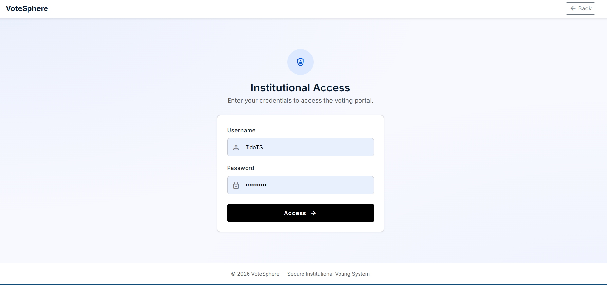
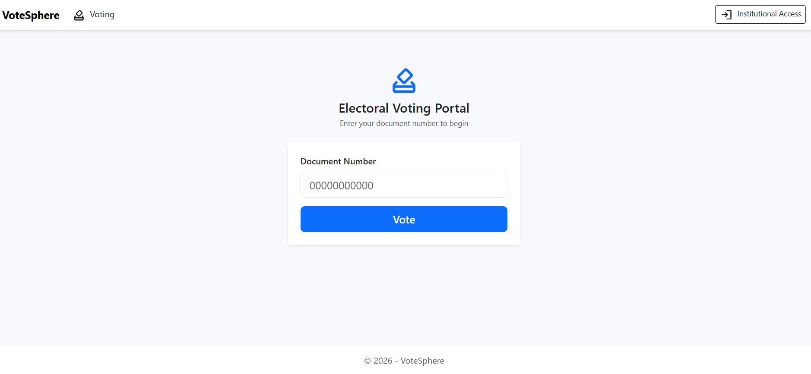
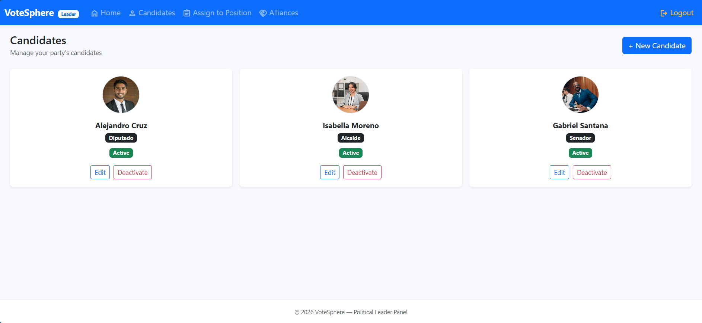
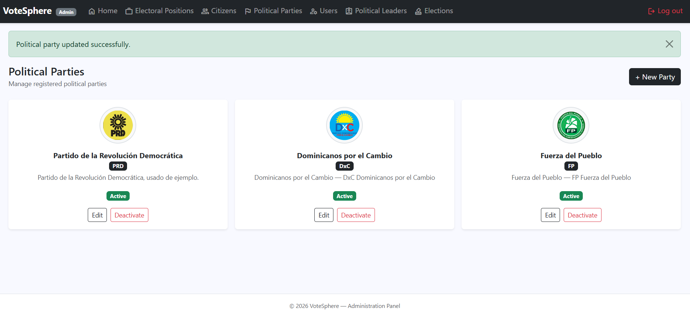
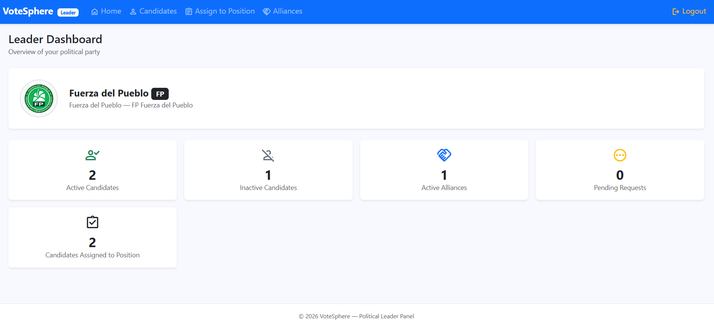
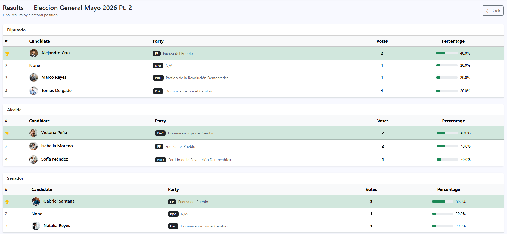

# VoteSphere — Electronic Voting Platform

A full-stack web application for managing electoral processes, built with ASP.NET Core MVC following Onion Architecture.

---

## Overview

VoteSphere is an institutional electronic voting platform that manages the complete electoral cycle — from voter registration and identity verification (via OCR) to candidate management, political party alliances, and final results reporting.

The platform was designed with scalability, modularity, and separation of concerns in mind, following clean architectural principles and layered application design.

---

## Features

### Public — Voter
- Enter document number to begin the voting process
- Identity validation via **Tesseract OCR** (ID card photo scan)
- Identity numbers are validated using an 11-digit numeric format without spaces or hyphens for reliable OCR recognition
- Browse active electoral positions and candidates
- Cast votes per position (including a "None" blank vote option)
- Receive a voting summary via **email** upon completion

### Administrator
- Manage electoral positions, citizens, political parties, and users
- Assign political leaders to parties
- Create and finalize elections (with prerequisite validation)
- View election results with vote counts and percentages
- View electoral summary by year on the home dashboard

### Political Leader
- Manage party candidates (create, edit, activate/deactivate)
- Assign candidates to electoral positions (with alliance rules)
- Send, accept, reject, and manage political alliance requests
- View party dashboard with key indicators

---

## Architecture

The project follows **Onion Architecture** with the following layers:

```
VoteSphere
├── Core
│   ├── Domain          — Entities, interfaces, enums
│   └── Application     — DTOs, ViewModels, Services, Mappings
├── Infrastructure
│   ├── Persistence     — EF Core repositories, DbContext, migrations
│   ├── Identity        — ASP.NET Identity, user management
│   └── Shared          — Email service (MailKit)
└── WebApp              — ASP.NET Core MVC controllers and views
```

---

## Tech Stack

| Layer | Technology |
|---|---|
| Framework | ASP.NET Core MVC (.NET 9) |
| ORM | Entity Framework Core (Code First) |
| Database | MySQL (Pomelo provider) |
| Authentication | ASP.NET Core Identity |
| Mapping | AutoMapper |
| OCR | Tesseract (spa trained data) |
| Email | MailKit / MimeKit |
| Frontend | Bootstrap 5 + Material Symbols |

---

## Key Design Patterns

- **Onion Architecture** — strict layer separation, no Infrastructure dependencies in Application
- **Repository Pattern** — generic and specialized repositories
- **Generic Services** — reusable CRUD service base
- **DTO Pattern** — data transfer between layers
- **ViewModels** — strongly typed views with validation attributes

---

## Business Rules

- A citizen can only vote once per election (validated after OCR identity check)
- An election can only be created if at least two active parties exist, each with candidates for every active position
- A candidate cannot be assigned to more than one position within the same party
- Allied party candidates can be assigned to positions, but must run for the same position as in their origin party
- Deactivating a political party automatically deactivates all its candidates
- All deletions are logical (soft delete via `IsActive` flag)
- Election history results are immutable — inactive entities still appear in past results

---

## Getting Started

### Prerequisites
- .NET 9 SDK
- MySQL Server
- Tesseract `spa.traineddata` file in `./tessdata/`

### Configuration

Update `appsettings.json`:

```json
{
  "ConnectionStrings": {
    "DefaultConnection": "Server=localhost;Port=3306;Database=VoteSphereDb;Uid=your_user;Pwd=your_password;"
  },
  "MailSettings": {
    "EmailFrom": "your@email.com",
    "SmtpHost": "smtp.yourprovider.com",
    "SmtpPort": 587,
    "SmtpUser": "your@email.com",
    "SmtpPass": "your_password"
  }
}
```

### Database Setup

```bash
# Apply Identity migrations
Update-Database -Context IdentityContext

# Apply Persistence migrations
Update-Database -Context EVote470PlusContext
```

The Identity seed will automatically create a default admin user:
- **Username:** `admin`
- **Password:** `Admin123!`

### Run

```bash
dotnet run --project eVote470PlusWebApp
```

---

## Default Credentials

| Role | Username | Password |
|---|---|---|
| Administrator | `admin` | `Admin123!` |

> Political Leader accounts are created by the administrator from the Users module.

---

## Screenshots

### Login Page
Institutional access page for administrators and political leaders.



---

### Voting Front Page
Initial public voting portal where citizens enter their identity document number.



---

### Candidate Management
Political leader interface for managing party candidates.



---

### Political Parties Management
Administrative panel for managing political parties.



---

### Political Leader Dashboard
Dashboard displaying party indicators and candidate-related information.



---

### Election Results
Election results page showing vote counts and percentages.



---

> **Note**
>
> Some projects, namespaces, and internal references within the solution still use the name `eVote470Plus`.
>
> VoteSphere is a refined and portfolio-ready version of an academic project originally developed at ITLA (Instituto Tecnológico de las Américas). Since the project was not initially intended for public release, certain internal names from earlier iterations (including `eVote360` and `eVote470Plus`) were preserved to avoid unnecessary large-scale refactoring.
